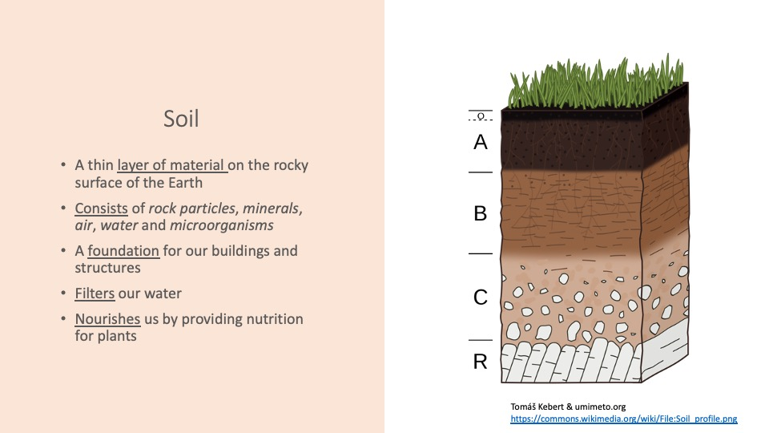
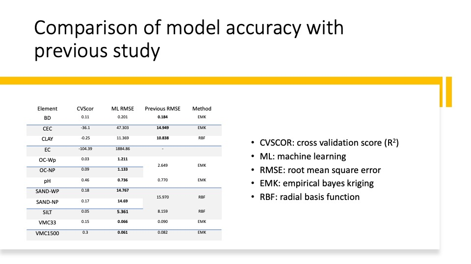
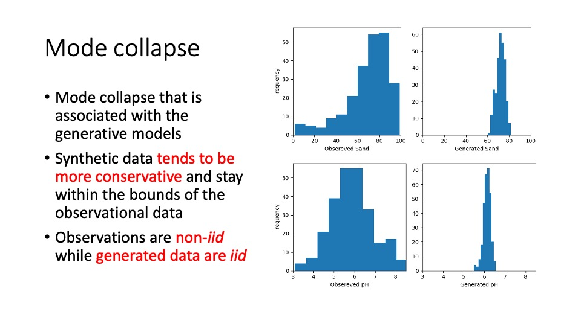

# Gen-SOIL

Generative Soil Information with Generative and Machine Learning Models.

<b>Code and data for <a href="https://gupea.ub.gu.se/handle/2077/72200?show=full"> Improving Soil Information with Generative and Machine Learning Models</b>

  

  

  
  
